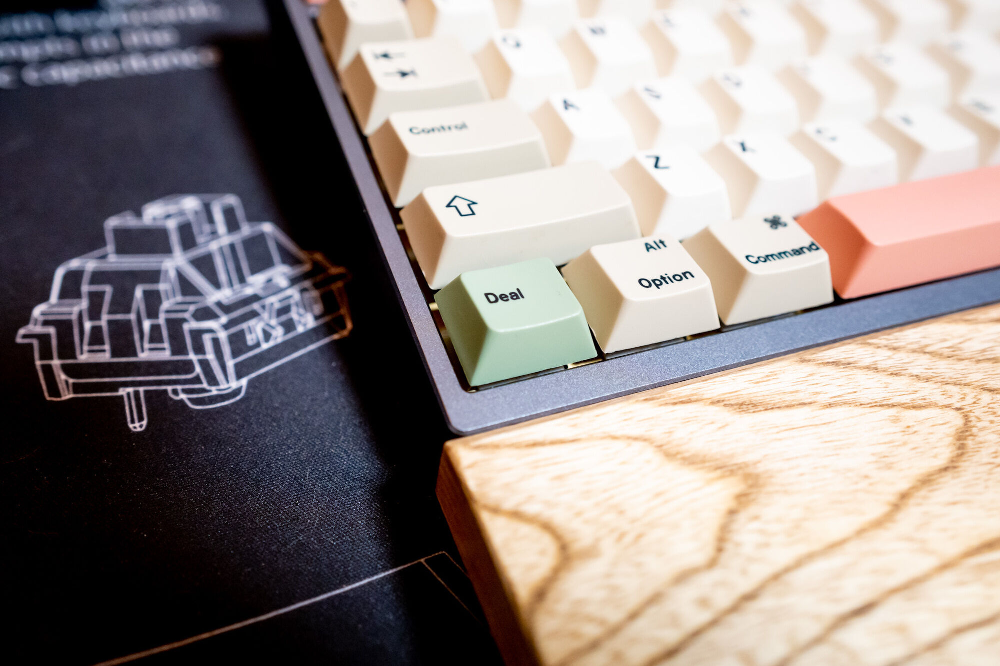
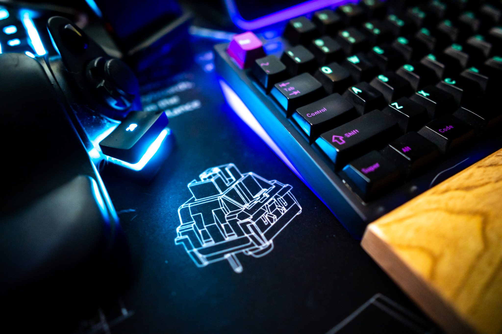

[kakutani](https://twitter.com/kakutani)さんから買い取らせて頂いたKBDfansのKBD8X MKII(アルミ)を組み立て終わったのでその日記。

去年の年末ぐらいにリハビリを兼ねてiOSの開発をやってみて気がついたこととして、ステップ実行などでFunctionキーを多様することに気がついた。
Xcodeにはショートカットキーを変更できる仕組みがあるので適当なキーに割り当てればよかったのだけども、もともとKBD67という65％キーボードを使っていたのと、ターミナルで慣れているショートカットの合間を縫うような設定になりやや苦労したのでいっそのこと領地拡大だ！と思い立って80％キーボードを探し始めたのが今年の1月。

もうそのタイミングではアルミケースの在庫はE-Yellowかポリカーボネートしか残っていなくて手持ちのキーキャップとの組み合わせや色味の感じが好きに慣れなかったのでポリカーボネート版を購入した。だいたい350ドルぐらい。
ちなみに2021-04-14現在ではRestockされているようでいくつかのキーボードは購入できるっぽい。
https://kbdfans.com/collections/kbd8x-mkii

もともと使っていたKBD67やChoco60のキーキャップを追い剥げばいいやと思っていたのだけども、そのまま放置されるキーボードもなんだかもったいないという気持ちになっていくつかキーキャップのGBにinした。

* JTK NIGHT SAKURA KEYCAPS
  * https://thekey.company/products/jtk-night-sakura-keycaps
* EPBT X OPENKEY LESS BUT BETTER KEYCAPS SET
  * https://kbdfans.com/products/icepbt-x-openkey-less-but-better-keycaps-set
* DROP + MITO GMK SERENITY CUSTOM KEYCAP SET
  * https://drop.com/buy/drop-mito-gmk-serenity-custom-keycap-set

当然だけど突然購入したキーボードの台の到着に合わせて上記のキーキャップたちは届くわけが無いので、一時的にキーキャップは追い剥ぎすることになる...。

そんなこんなで2月の頭にはKBD8X MKIIが届いて、スイッチやスタビライザーが届くのをまったりして最終的に3月の頭ぐらいには完成した。

具体的な構成は後でまとめて述べるが近いうちに再開されるであろう物理出社のことを考えると、どう考えても2kgもあるキーボードをかばんに入れて運ぶのは困難で腰が死ぬ。なので、会社の常備できるように同じキーボードを2台組みたいという気持ちが湧いてきた。

<blockquote class="twitter-tweet">
クソ重キーボードをつくってて一番困るのは職場に出社したときに持ち運びを躊躇すること。
&mdash; あそなす (@asonas) <a href="https://twitter.com/asonas/status/1372768615380905993?ref_src=twsrc%5Etfw">March 19, 2021</a></blockquote> 

その後、もう手に入らないKBD8X MKIIに対してモニョモニョTwitterをしていたら、たまたまkakutaniさんからリプライをもらってアルミ版を買い取らせていただけることになった（ありがとうございます！！）

<blockquote class="twitter-tweet">
たっかんにアオられて輸入したsilverの在庫がありますよ!! 2kgを越える重さがすごいそう、というのを確認して満足したからいつでも譲れます!!q
&mdash; Kakutani Shintaro (@kakutani) <a href="https://twitter.com/kakutani/status/1370263678130352133?ref_src=twsrc%5Etfw">March 12, 2021</a></blockquote> 

また同じようにキースイッチとスタビを購入してしばらくまって、4月12日にこれも完成した。GBじゃないキーボードは1年も待たなくて良いんだ！！！って思った。

## パーツ構成

最終的なパーツ構成は以下の様になった。

### Case

* KBD8X MKII GREY CUSTOM MECHANICAL KEYBOARD KIT
  * https://kbdfans.com/collections/kbd8x-mkii/products/kbd8x-mkii-custom-mechanical-keyboard-kit-for-grey
  * アルミ版
* KBD8X MKII INK BLACK POLYCARBONATE CUSTOM MECHANICAL KEYBOARD KIT
  * https://kbdfans.com/collections/kbd8x-mkii/products/kbd8x-mkii-custom-mechanical-keyboard-kit-for-ink-black-polycarbonate
  * ポリカーボネート版（ちょっと値段が高い）

### Switch

* DROP + INVYR HOLY PANDA MECHANICAL SWITCHES
  * https://drop.com/buy/drop-invyr-holy-panda-mechanical-switches
  * lubeやバネはそれぞれで
    * Tribosys 3203, MX Slow Extreme 65S
    * GPL205g0, (default spring)

### Stabilizer
  *  Durock V2
  *  Shimano Premium Grease

上記の様な感じ。机の上の乱れを映し出さないように撮影したアー写っぽい写真。

asakusakbの方面では拙いながらも聴き比べ録音ファイルを公開したりしたが、音はポリカだと甲高い音がやや響きやすい印象がある。打鍵感はバネの交換や潤滑油の違いもあって全然違う。

僕にKBD8X MKIIを勧めてくれた同僚氏にHoly PandaにはGPL205g0をおすすめされたが、個人的にはTribosys 3203の方が好きかもしれない。ただ、バネも交換してしまったので単純な比較ではないのにも注意したい。
バネの交換は今回始めてやってみたけど、今までの経験から最初に選んだパーツが未来永劫好みのパーツとも限らないので引き続き研究していきたい。バネは1ロット(100個)で1500円ぐらいなので実質無料。

キースイッチの変遷で言えば、最初は（いわゆる赤軸とか青軸とかなんか色々）-> Zeal PC Orange Healios -> Zeal PC Sakurio -> BSUN Red Pandas -> Invyr Holy Panda という流れ。Invyr HolyP Pandasは最終的に300個ぐらい買ったかな...。ある一定の期間まではリニアスイッチ一択だったんだけど、流れが変わった BSUN Red Pandas を手に入れられたのは件の同僚氏が安価で譲ってくれたのもあってそこからタクタイルスイッチにのめり込んでいきました。
一時期は静音リニアが好きでSakurioを買いまくっていたけど、経験してみなきゃやっぱわからないことがたくさんありますね。

スタビに使った潤滑油はいわゆる自転車のペダルのネジ部分につけたりするグリス。kai4562さんの記事を読んでハッと気づきました

> スタビライザーにはBGR-002という自転車のセラミックベアリング用として売られているグリスを使うのがマイブームです。
>
> <cite>[カスタムキーボードとかいう理解不能な趣味について説明します](https://note.com/kai4562/n/n4a68066152fb)</cite>

これもかなり自分の中では正解ぽくて、しばらくお世話になりそう。

## 実際に使ってみて

2つのキーボードを使い始めてしばらく経過しました。2つの差分としては、ケースの素材と潤滑油、バネぐらいなんだけど、打鍵感や音がだいぶ違うのが印象的です。同じキーボードなのでプレートごとごっそり入れ替えることでケースの違いを楽しむことはできるのですが、はんだ付けしてしまっているスイッチ分の差分は得られないのが少し残念です。ケースはアルミ、スイッチの潤滑油はGPL205g0、バネMX Slow Extreme 65Sよりもちょっと軽いの、みたいなのを試してみたいのですが、ちょっと腰が重い...。その気になればプレートやPCBだけの販売もあるので、ケース無しの状態のキーボードを組んで交換、というのも可能ですが、うーむ...。

全体的な感想としては、大変満足行くキーボードが組めたと思います。2019年に「これだー！」と思いながら組んだKBD67の頃と比べると、より自分の感覚がより研ぎ澄まされて「個人的な好み」がより明確になったと思います。経験主義〜。

## カスタムキーボード、あるいはDIYキーボード

小学生のころミニ四駆が好きでローラーの位置やダンパーの調整、外装の肉抜きとか色々凝ったことをやっていたのを覚えています。カスタムキーボードと呼ばれるものもそれに近いものがあると感じています。
カスタムキーボードにもスイッチやバネ、マウント方式、潤滑油の種類等々、多くの考慮すべき事項や趣味趣向に突き進める部分があり、それぞれ完成したものが自分の手触りとしてフィードバックされ次に繋げて行くのは、まさにミニ四駆のカスタムと同じだなぁと。

沼、と呼ばれ忌諱される場面もありますが、2021年の「DIY」や「Maker」的なコミュニティの盛り上がりの現場としてカスタムキーボード、DIYキーボードと呼ばれる世界は面白いところだと感じています。

2021年、上でも述べたように自分のイマココとしてはKBD8X MKIIに施せたカスタムが最も良いという感触があります。ただ、これは2019年に、件の同僚氏のそそのかされて買ったKBD67を組んだときと同じ感覚です。
特にこの時に衝撃的だったのは、同僚氏とキーキャップ以外はすべて同じパーツで組んだはずなのに完成したキーボードを実際に会社で打鍵しくらべてみるとそこには明確な「差」がありました。

[KBDfans の KBD67 というカスタムキーボードをつくった](https://recompile.net/posts/built-a-kbd67.html)

当時は「なんだこれ！」と思いましたが、今思えばここには潤滑の技量的差やスタビライザーに施した静音化の施しに差があったように思います（たまたま同年に[自作キーボードインターン](https://techlife.cookpad.com/entry/2019/02/25/195000)というイベントがあり、そこで更に多様なカスタムキーボードに触れる機会があったのも良かった）
組む人によってカスタム良し悪しが決まる、というのもまさにミニ四駆的ぽくて好きですね。

僕にとって、キーボードは仕事道具でもあるのですごく尖ったものをつくるということはないかもしれませんが、引き続き細く長く続けていきたい。
