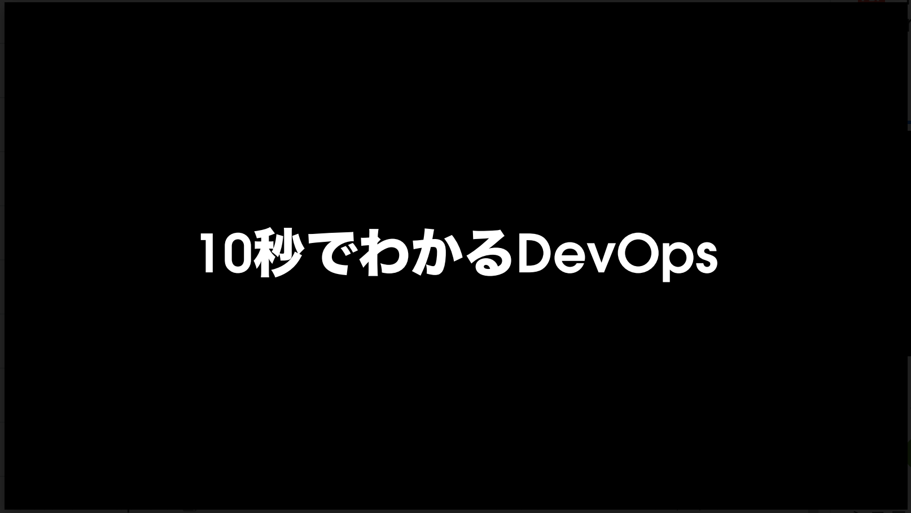
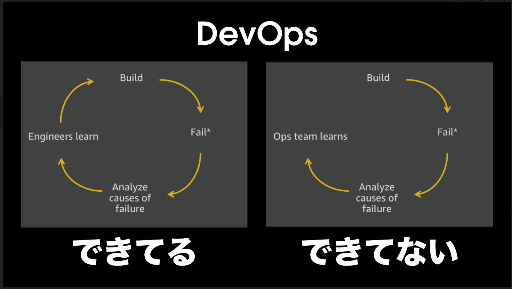
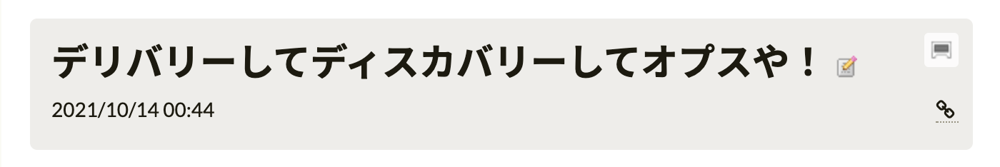
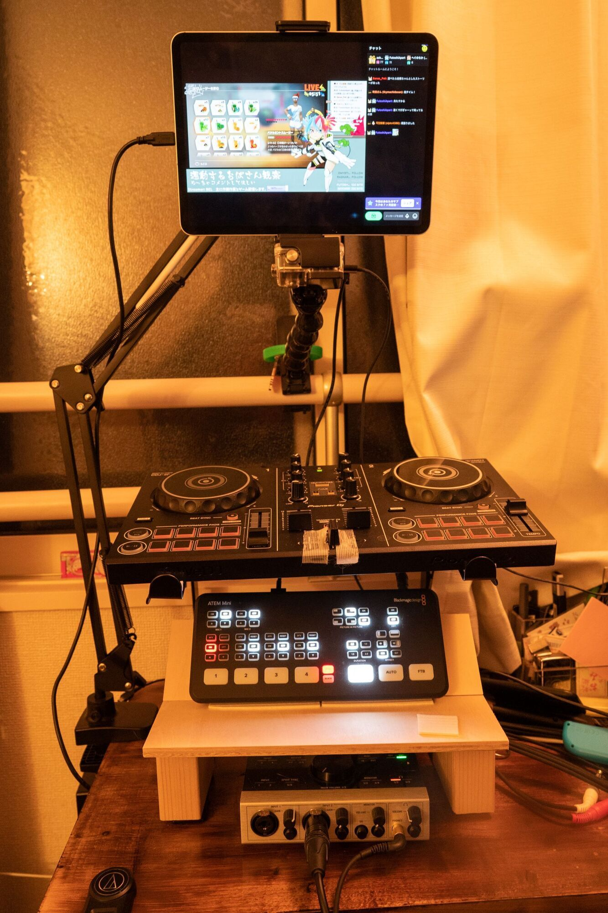

これは [KOBA789 日記 Advent Calendar 2021 - Adventar](https://adventar.org/calendars/6302) 10日目の記事です。

昨日は KOBA789 による9日目の日記はありませんでした。明日はまだ空いている模様です。

今年は元気があってたくさんの[Advent Calendar](https://adventar.org/users/1645)に応募していてるのもあって、いい感じにネタが被らないようにしているんですが、そろそろネタ切れだ。さて、KOBA789 日記 Adent Calendarでは何を書こうか。

KOBA789とは元同僚でクックパッドという会社で一緒に働いていた時期がありました。そんな中でKOBA789が2019年にre:Inventに参加してきた時の資料の最後のページが気に入ってます。

普段の仕事は全部やる係(DevとかOpsとか言ってられない)なので、このスライドを今でも思い返します。全体の話としてはre:Inventの新しい製品をKOBA789なりに解釈してしゃべるという資料です。全編読みたい方は[こちらからどうぞ](https://info.cookpad.com/careers/)

最近僕が書いた社内向けのブログにもこのような記事があります。

これもDevOpsの文脈で書いてあって、どのようにチームで「やっていく」のかというのを[過去二ヶ月分ぐらいを振り返り](https://speakerdeck.com/asonas/the-scrummasters-guide-to-the-galaxy)つつ書いてあります。

DevOpsは「できてらぁ！」と思っていても、日々を繰り返して学びを得ていくと「ここ足りてなかったね！」という発見があり、ある種の希望または絶望があり、プロダクト開発の難しさに直面することになります。どちらか片方だけやっていれば幸せな世界もあるのかもしれませんが、真に価値を届けられているとはならない事の方が多いです。人類が解決したい問題は難しくなった。そしてそれに気がつくことができるようになったのは良いことなのかもしれません。[Red pill and blue pill](https://en.wikipedia.org/wiki/Red_pill_and_blue_pill)

閑話休題（何の話だっけ）

そうそう、宣伝をしておくと、12月17日の22時ごろから[DJ Mix Advent Calendar 2021](https://adventar.org/calendars/6378)にてライブでDJをやります。いつもの[Twitch](https://twitch.tv/asonas)で配信予定です。参加者の方々のMixがかなり硬派な感じで勢揃いしていて普段のやわなDJをやって良いものかと思ってる。まぁ「でもやるんだよ！」でやるだけなのでやるんですが...。

6畳しかないけど、自室にDJブースを建立して少し高い位置にDJコントローラーがあるのでもう中腰でDJしなくていいのがポイントです。

真上にカメラがあってかなり寄れるのもアップデートポイントですね。手癖とかが丸わかり。ATEM miniにα7Cもつなげるので別の視点で配信するかもですが...。

取り留めもない話になってきたな。そろそろ終わります。またね〜。
