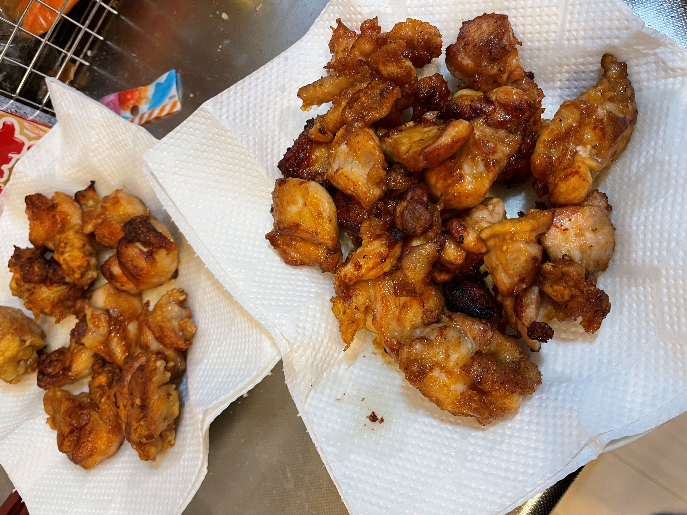
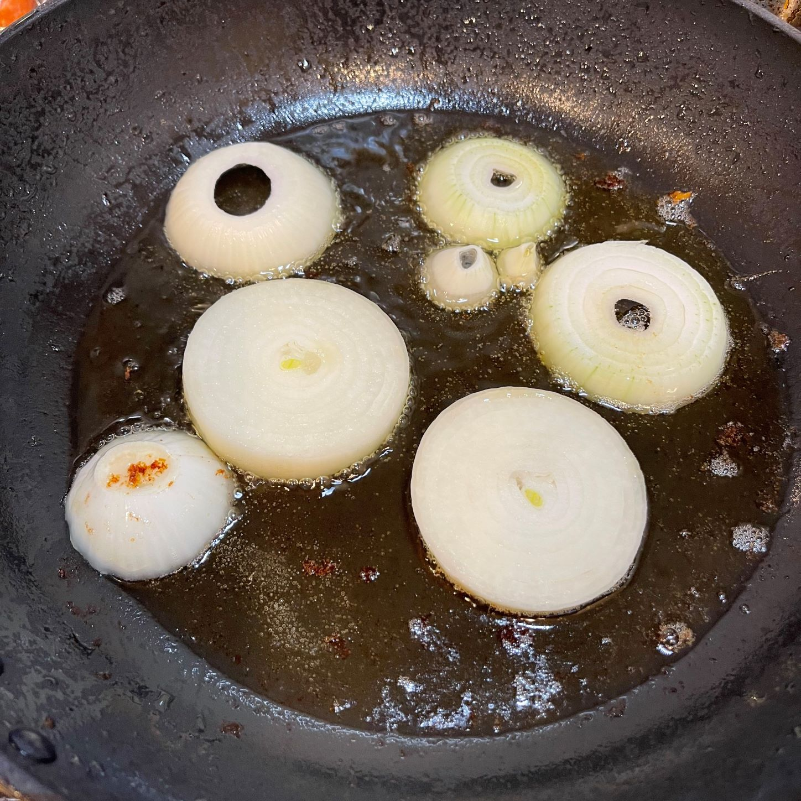

これは [KOBA789 日記 Advent Calendar 2021 - Adventar](https://adventar.org/calendars/6302) 11日目の記事です。

昨日は@asonasによる日記でした。明日はまだ空いている模様です。

今日は唐揚げをつくりました。料理は毎日やってる。たのしいかと言われるともはや20年ぐらいやってるので義務、ルーティン、日常、という感じ。たまにいい食材が手に入ると調理工程が楽しくはなったりします。

唐揚げ。たまたま冷蔵庫にもも肉が2枚入ったパックが余っていました。賞味期限が4日前でギリギリか？と思いつつも匂い的には問題なさそうだったので、夕方ごろに一口サイズに切り、1枚はニンニク生姜だしの素醤油で味付け、もう一枚はニンニク生姜オイスターソース豆板醤甜麺醤で味付けをして別々のビニル袋に入れて冷蔵庫へ。

適当に子供と公園とかで遊んで帰ってきて揚げる、というか焼きました。フライパンが33センチもあるので浸るほど油を入れようと思うと何個揚げるねんとなるので底から5mmほどの油にして片面づつ焼く作戦に出ました。ビニル袋から取り出すときも一個ずつ出すとかだと手間なので絞り出す感じでフライパンに出して菜箸で適当に重ならないようにする。適当でいい。

油が余ったので、玉ねぎを素焼きにしました。妻が玉ねぎを食べないので玉ねぎが余りがち。適当に輪切りにして焼く。味見をしたけど劇的にうまい、というわけではないけど、まぁ雑な付け合せとしては捗る。

あとはひき肉と人参と大根で肉味噌とかも作ったけど写真取るの忘れてた。ポトフとご飯で今日の晩ご飯です。
