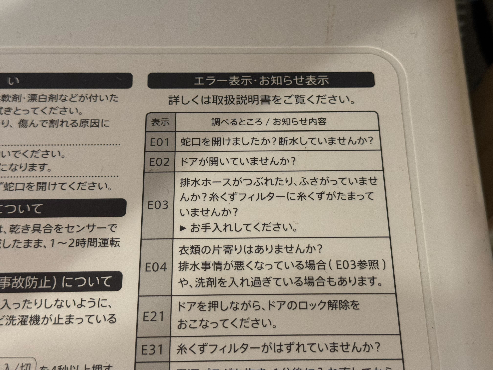
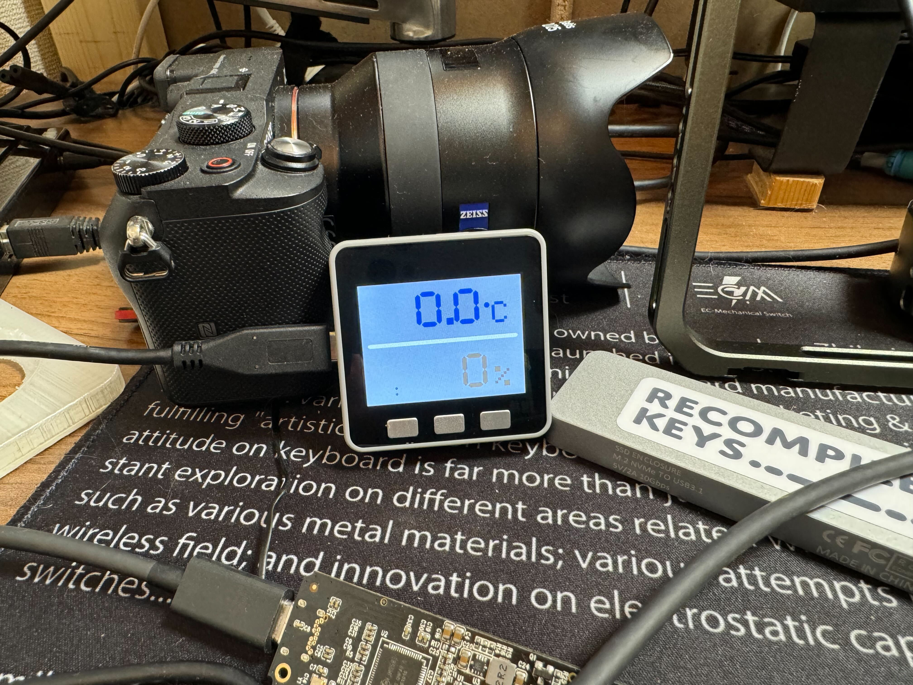
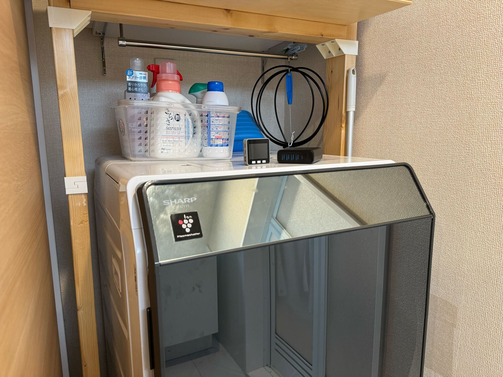
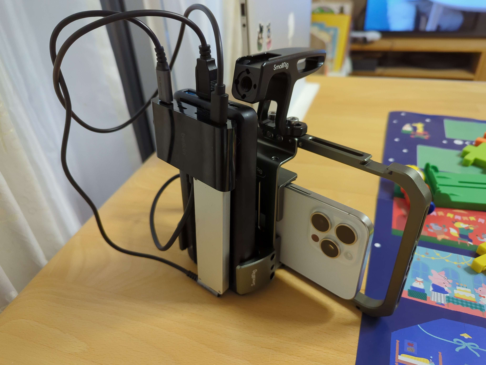
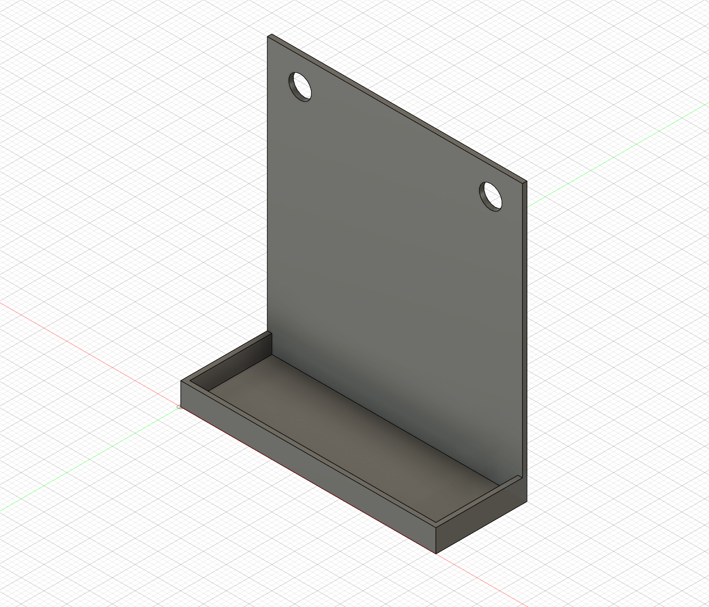
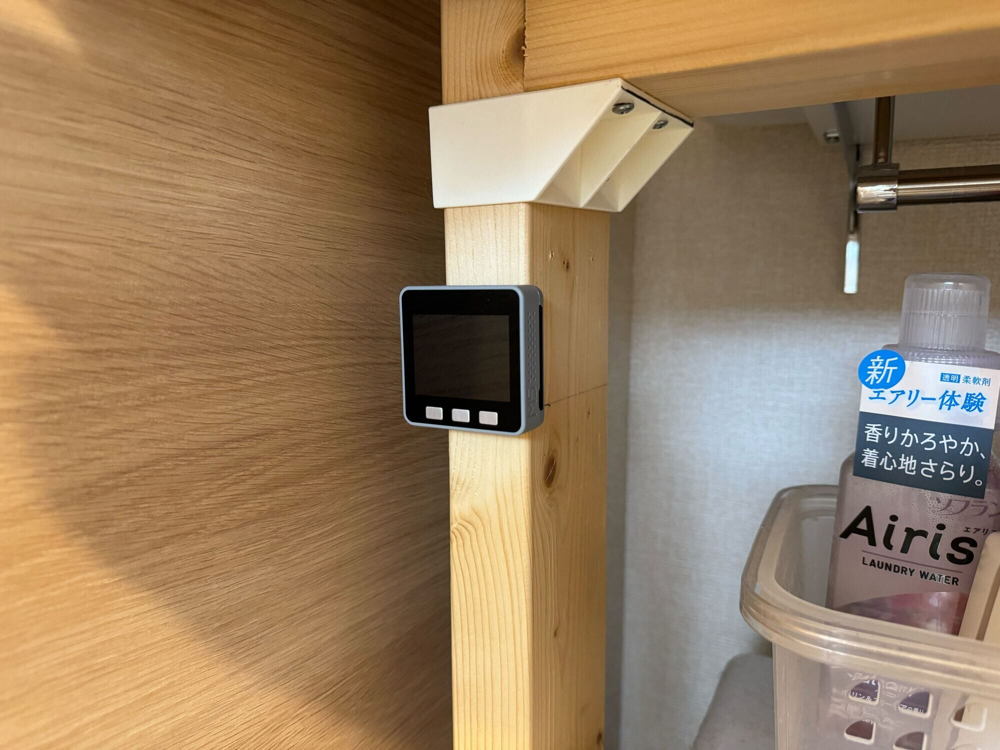
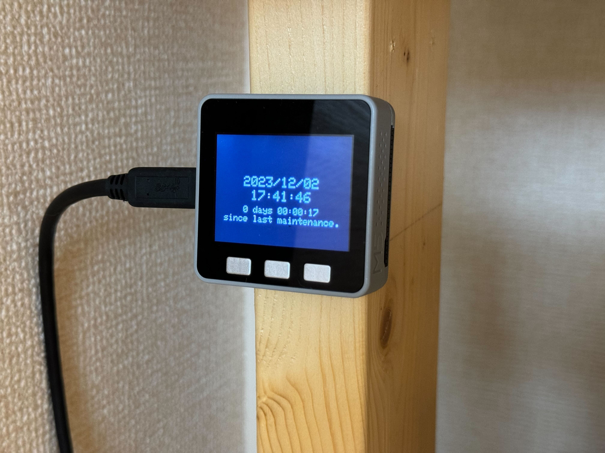

こんにちは、あそなすです。

このエントリは、[SmartHR Advent Calendar 2023](https://qiita.com/advent-calendar/2023/smarthr) シリーズ2の2日目です。1日目は ykarakitaさんによる「RSpecでテストケースのテストを書きたい」でした。テストデータのテストをしていた事があるのでなかなか興味深い内容でした。ソフトウェアテストに対するアプローチって色々あっていいですよね。

自宅でTOSHIBAのドラム式洗濯機を使っています。結構便利に使っているんですが、洗濯機の下部に排水のカゴがありそこに洗濯中に出た糸くずなどが貯まるようになっています。
サードパーティの製品で排水ネットが出ていて掃除が簡単にはなっているのですが、この掃除をおこたると排水ができずにエラーがでます。そのエラー表示がE-03です。これが出るとどうなるかというとすすぎ行程の排水に失敗しているということで排水のカゴを引き抜くと庫内の水が出てきます。少量であれば洗面器などで受け止められますが、すすぎの真っ最中だったりするとバケツレベルの入れ物が必要だったりしますし、幾ばくかは水が垂れて洗濯機が乗っているパッドがぬれてしまいあまり衛生的ではありません。

自宅で猫を2匹飼っているのもあって、頻繁に排水エラーが発生するため、この洗濯機の排水ネットの交換は忘れずに週に1回、または2週に1回のように定期的にやる必要があります。

諸事情あって直近2ヶ月ぐらい余暇があったんですが、余暇があっても忘れるものは忘れるのでこれを仕組みで解決したいと思います。

家族では主にSlackで連絡を取り合っているのでSlackに何か通知ができると良さそうです。初手で思いつく作戦としては `/remind` で毎週通知するとかでしょうか。ただ、これはすでにゴミ捨ての通知で使っていますが、燃えるゴミの日など主要なゴミの日は習慣付いてしまっているので有用でなかったり、ペットボトルや缶などの資源ゴミはある程度たまるまで放置してしまうので通知自体がオオカミ少年と化してしまっている課題があります。なので、同じ手法で排水ネットの交換を円滑にやるにはすこし不安が残ります。

定期的な通知では根本的な解決にならなさそうで、ゴミ捨てとは違い「いつ」交換したか？ということが重要そうな感じがしてきます。

排水ネットの交換もカゴの蓋を回して引き出すだけと思いきや、排水ネットを捨てる小さいゴミ袋を用意したりカゴの汚れをティッシュで拭いたりと手間があるので、ここに携帯からSlackに「交換したよ」と入力するのも煩わしいです。

Slackに1アクションでスッと通知できるような仕組みを考えてみると、iOSのショートカットも手段としてはよさそうですが、自宅で常に携帯を持っていることはないので、携帯からやるというよりも洗濯機の近くに常設してあるとよさそうです。

また、幸いな事に自宅では潤沢にWi-Fiの電波が飛んでいるので何らかの端末からインターネットを経由してSlackのAPIを叩くことは可能です。

状況を整理すると、

- 洗濯機の排水ネットの交換を忘れると排水ができずに掃除の時に大変になる、洗濯機パッドが水浸しになるなどの問題がある
- 定期的に排水ネットを交換すれば問題がない。夫婦のどちらかが交換をすればよい
- 自宅では夫婦でSlackを課金して使っているぐらいには日常的に使っている
- 自宅にはWi-Fiが飛んでいる。洗濯機が置いてあるところにはコンセントは2口ある

という状況です。

ちょうど手元にM5Stackがあるのでいろいろやってみましょう。

パソコンにつなぐと温度と湿度が表示されたのを見ると以前は温湿度計として動いていたようです。ちなみに今はSwitchBotの温湿度計に置き換わっています。

デバッグのログなどが残っているのですが、ざっとコードはこのような感じです。

SlackのWebHookを叩く際のURLEncodeの処理は虎の穴開発室ブログの「M5StickCで室温を監視しSlackへ通知する」を参考にしました。

https://toranoana-lab.hatenablog.com/entry/2021/09/29/125441

encodeURIComponentのヘッダファイルは上記のブログ（リポジトリ）を参照してください。

それでは早速洗濯機の近くに設置します。手頃なAC電源が無かったので不要になったUSB電源を使います。昔使っていたNikon Z7のAC電源がどこかにあると思うんですが見つからなかった...

2x4のSPF材で収納を作っているので適当に固定します。

当初は3Dプリンターで適当なケースを作って、ケースだけビスで固定しようと思ったのですが、たまたまiPhone 15 Pro Maxのリグ（下の写真）をつくるのに注文していたベルクロが届いたのでとりあえずこれで固定をしてしまおうと思います。

この写真のようにバッテリーケースやUSBハブ、SSDにベルクロを貼り付けて取り外し可能な状態にすることでポータブルなリグを構築することができます。余談ですが、来年はこの構成でMV撮影をやっていきます。また、Apple ProResが登場してから約10年（！）になりますが、実際に自分で使ってみると予想以上にカラーグレーディングの幅があってなかなか面白いですね。

ベルクロの商品としては下記です。テープ式でハサミでカットできるのでかなり便利です。梱包の箱がケースを兼ねているので使わない時の収納にも困りませんでした。

<iframe sandbox="allow-popups allow-scripts allow-modals allow-forms allow-same-origin" style="width:120px;height:240px;" marginwidth="0" marginheight="0" scrolling="no" frameborder="0" src="//rcm-fe.amazon-adsystem.com/e/cm?lt1=_blank&bc1=000000&IS2=1&bg1=FFFFFF&fc1=000000&lc1=0000FF&t=drosseladd-22&language=ja_JP&o=9&p=8&l=as4&m=amazon&f=ifr&ref=as_ss_li_til&asins=B08PBJ8B1K&linkId=1319c4446587a3b54965b0832069237f"></iframe>

[[Hirano] 面ファスナー 超強力マジック貼付テープ[Pitafa] ベルクロ 両面テープ付き 耐熱 防水 (2cm×5m, 黒)](https://amzn.to/4a4fyes)

3D出力されることの無かったモデルはこんな感じでした。2分でつくったので素朴なつくりです。

実際に設置するとこんな感じ。

電源をいれるとこんな感じ。

電源ケーブルが壁に緩衝していて引き戸にぶつかってしまったり、ケーブル自体が太くて取り回しがしにくかったりAC電源が巨大すぎるなど電源まわりは少し課題がありますがひとまずはこれで

1. 排水ネットを交換したらその手でボタンを押す
2. Slack通知が行く＋M5側に排水ネットを交換した日時が記録される
3. もし最後に交換してから一週間経過していたら、M5Stackから改めてSlackに通知が飛ぶ

というようになりました。しばらく運用してみようと思います。

足りない、またはあるとよさそうな機能としては、

- 電源が落ちたりすると記録していた排水ネットを交換した日時を喪失する
  - microSDカードなどを利用してメディアに書き込むとよさそう
- 電源駆動からバッテリー駆動に切り替わった時に通知したい
  - 実はM5Stackにはバッテリーがあるので電源コードが抜けるなどで電源を喪失してもある程度は動く（はず）
  - バッテリーで駆動になったら通知する、という仕組みはあってよさそう（UPSにあるみたいなやつ）

あたりがパッと思いつきますが、とりあえずアドベントカレンダーに間に合わせるために今回はこのあたりにします。

2,3日前からゆるゆるとコードを書き始めて200行弱でやりたいことが実現できてよかったです。M5Stackのような小さいけどインターネットにつながる機械はアイデア次第で手が届く範囲の課題をサクッと解決できる良いガジェットだなと思います。

スイッチサイエンスさんでも豊富に取り扱いがあるのでもし興味があれば是非のぞいてみるのはどうでしょうか。

https://www.switch-science.com/collections/m5stack

明日は nagata03 さんによる「兼務はいいぞ！（ホントに？）」です。それではまた。
