年末だなぁと思ったので、今年のよかったものをまとめます。
今年に発売されたかどうかはあんまり関係ないです。
### アタシとお前の564日

今年も細々とウマ娘をやっていて引き続きゴルシことゴールドシップを推してる。フリクリのハルハラ・ハル子よろしく、日常をはちゃめちゃにする女性に弱い。

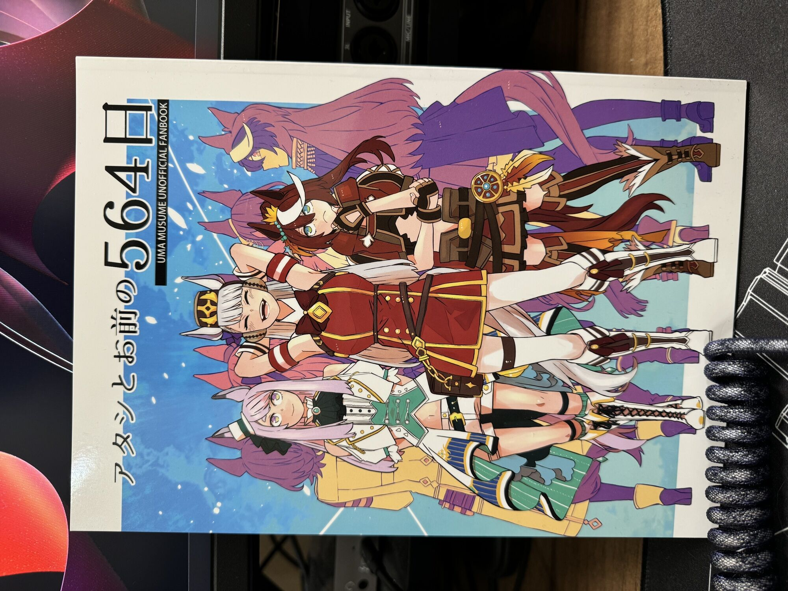

https://www.melonbooks.co.jp/detail/detail.php?product_id=1998933

タイムトラベルものでSF感があってかなりよかった。元々、アスカさんのイラストが好きで昔から追っていて好きなイラスト・SF・ゴルシというコンボでかなり楽しめた作品でした。

### 親子ダービー(仮)!

同じくアスカさんの作品。ウマ娘がその作品の性質上、親子関係もしくは祖父孫関係がある登場人物が多数いて、ストーリーをやっていてもそのあたりを擦ってくることもあり史実もの作品が好きな自分としてはツボなところでもある。
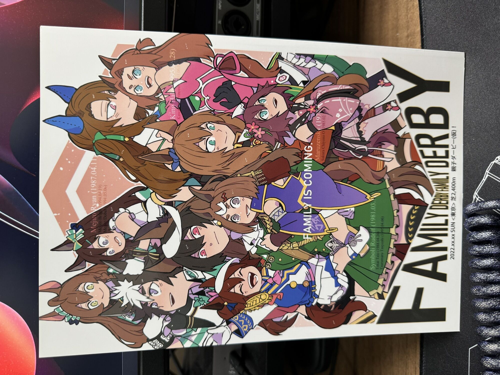
https://www.melonbooks.co.jp/detail/detail.php?product_id=1712187

その親子関係を持つウマ同士でペア（チーム）を組み、かけっこをする作品なんだけど、群像劇ぽく演出されていて、群像劇が好きな自分にはすごく楽しめた。二次創作ならではとしては子の方の作画がチビキャラになっているのもよかった。

### 馬場庵6

ヒシアマゾンが飯をつくるシリーズ6作品目（雑）

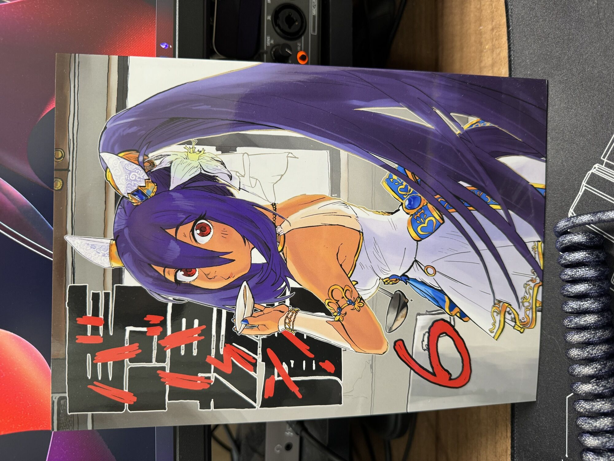

https://www.melonbooks.co.jp/detail/detail.php?product_id=2128351

1からずっと買っていて毎度おいしそうだなぁと思いながら楽しんでる作品。料理あるあるな演出とか食べる時の仕草とかをきちんと描いていてかなりツボ。ウマ娘たちが料理を楽しそうにやっているのがすごくいい。
### みんなハイになる

水着タキオンが引けなくてかなしみにくれながらタイムラインを見ていたら見つけた作品

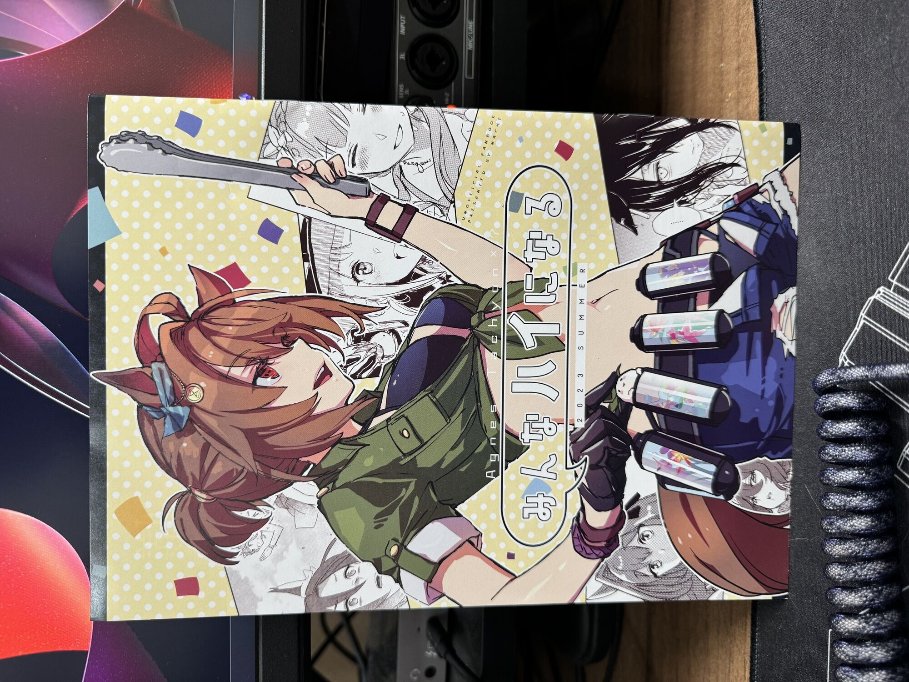

https://www.melonbooks.co.jp/detail/detail.php?product_id=2044194

ゴルシよろしく日常をはちゃめちゃにする女性に弱い。タキオン本としてはナヅカ先生の新刊も予約していておそらく年明け届くと思う。楽しみ。

https://www.melonbooks.co.jp/detail/detail.php?product_id=2170489

### さよなら。マイワールド

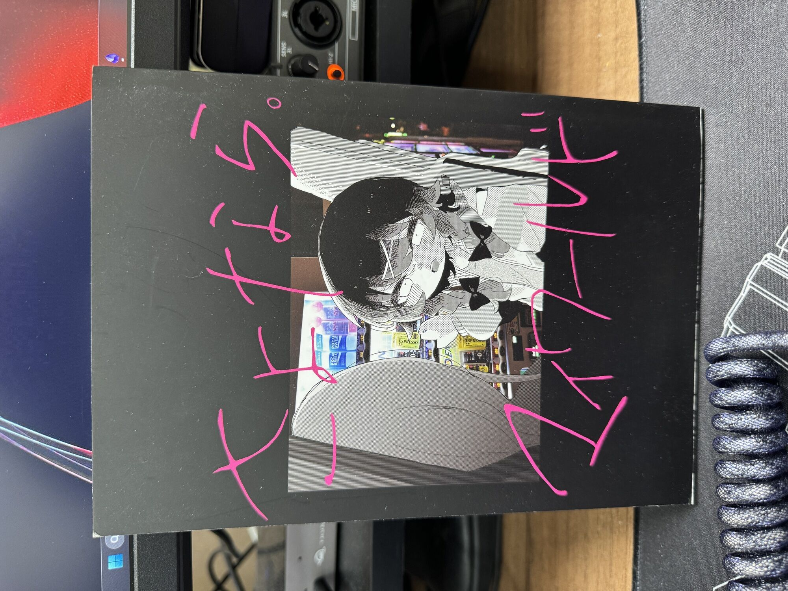

とても、エモい。音楽をやる身としてグッとくる部分がありウ〜とうなってしまう場面もあった。

https://booth.pm/ja/items/4746642

樫野創音さんによる同名の曲も同時にリリースされておりSpotifyで聞けます。

<iframe style="border-radius:12px" src="https://open.spotify.com/embed/track/6qlggNL4qGGNqfCl0ThxR7?utm_source=generator" width="100%" height="352" frameBorder="0" allowfullscreen="" allow="autoplay; clipboard-write; encrypted-media; fullscreen; picture-in-picture" loading="lazy"></iframe>

百合（百合か？）で若干のR指定もあるけど曲と漫画のマッチがとても良いので興味があれば是非手にとってもらいたい作品です。
### レインボーパンジー、VSコロナ後遺症

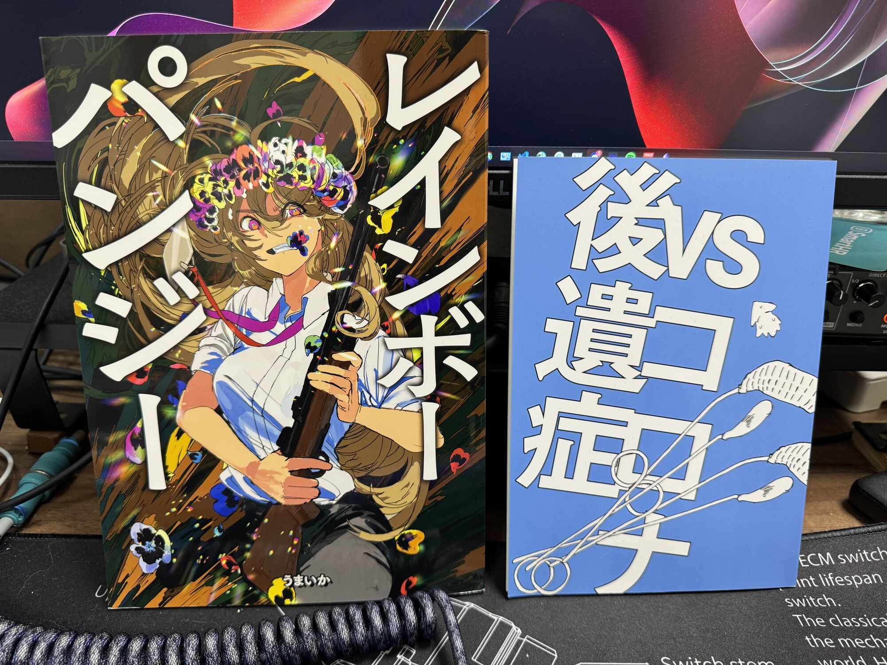

突如登場したサークルによるオリジナル同人誌。過激で勢いがあり、これぞ同人誌...!と思わされるような作品でした。妻がコミティアにいく時に買い出しをお願いして（現地ではうまいかのかぶり物をした人がいたらしい）なんとか入手できたけど、今はメロブでも買えるので買って行きましょう。

https://www.melonbooks.co.jp/detail/detail.php?product_id=2265199

ワンレンボブに対するすごい執着がある人だなと思っていてこの作品でもその魅力がバーンと満ちており読んでいて幸せな感じがした。これからもずっと応援していきたい所存です。ピンバッジも併せて買ったけどどこにつけようかな。

VSコロナ後遺症の方は単純に体験記として面白かったです。

https://www.melonbooks.co.jp/detail/detail.php?product_id=2174125

今更気がついたけど、こっちは	Golem,Inc だったのか...。幸いにも自分はまだコロナを患ってない（と思う）ので後遺症などはないんだけど、慢性的な鼻炎で年間の半分ぐらいは鼻炎でたまにひどいときは副鼻腔炎と診断されて薬を飲むで済ませることが多々あったのだけども、ガッと棒を突っ込んで喀血して治るならありかもな...という感じはしてきた。
### ちがう

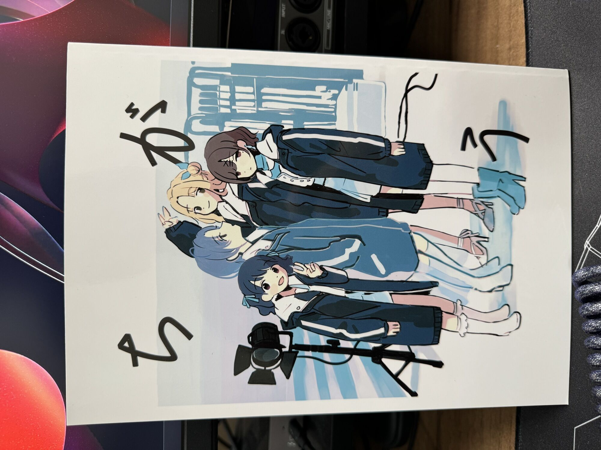

> そこまで作中にリアルタイムには居なかった浅倉透が最後の1ページに出てくる、「ちがう」人を映した浅倉透さんの本です。

この一文がとても好きで買った作品

https://www.melonbooks.co.jp/detail/detail.php?product_id=1788289

複数人による作品で様々なシーンで「浅倉透が最後の1ページに出てくる」エモさよ。一番最初のお話が個人的には大好き。
### FGO LOG

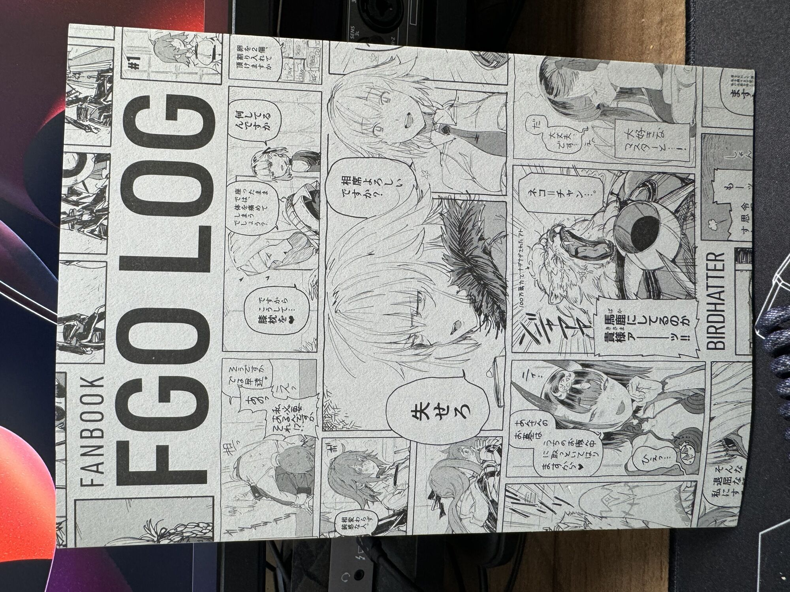

昔からBirdHatterさんのイラストが好きでpixivをずっと追っかけていたけど、最近はモレーさんの作品を公開していたりしてふむ〜となりながら読んでいたらいつの間にか買ってしまった作品。

https://www.melonbooks.co.jp/detail/detail.php?product_id=2108525

最近Twitterで公開している [#デカフェDIARY](https://twitter.com/search?q=%23%E3%83%87%E3%82%AB%E3%83%95%E3%82%A7DIARY&src=hashtag_click) [#お紅茶お戦記](https://twitter.com/search?q=%23%E3%81%8A%E7%B4%85%E8%8C%B6%E3%81%8A%E6%88%A6%E8%A8%98&src=hashtag_click) もかなり好き。
### VR能 攻殻機動隊

これは、人を、選ぶ...!!!!!!!!!!!

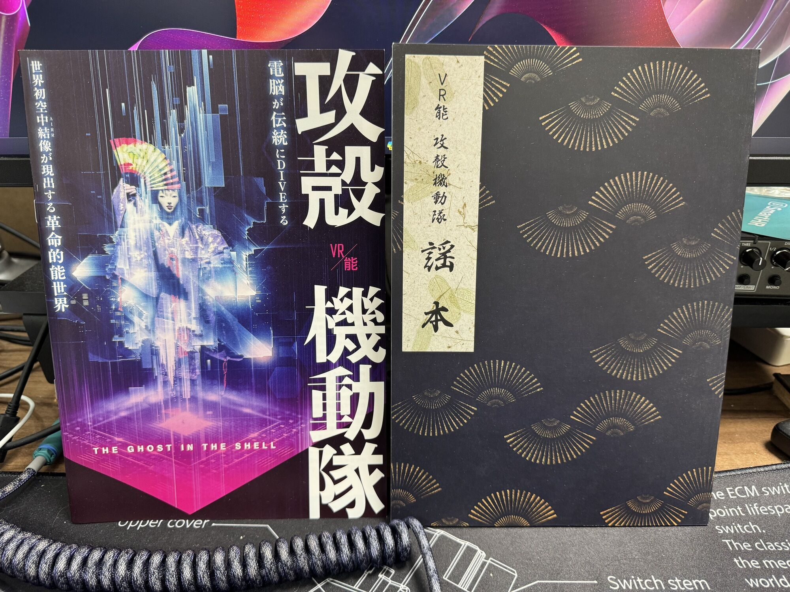

https://ghostintheshellvrnoh.com/

個人的には攻殻機動隊が好きで現地に見に行ったけど周り（友人で見に行った人は0人だけど）を見渡す感じ、僕は楽しめた方だなぁ。VRと言われるとゴーグルを付けて見るイメージがあるけど、ゴーグルなしで体験できるのは結構おもしろい。機材の都合で映像化はたぶんされないかもなぁと思ったりしたので見られてよかった。

いわゆる最先端の映像技術を使った演出に限らず古来からある技法を使った舞台の演出を混ぜ込むのがとてもよくて何気なく見ていてパッとその演出に遭遇するとめちゃくちゃびっくりする。

当日は津田健次郎氏によるナレーションやインタビューがあって、それだけでチケット代はペイしたなと思う。座席もど真ん中だったし。

### Backbone One PlayStation Edition

昨今全然ゲームするタイミングがないのでパッとプレイするためのデバイスを買ってみた。

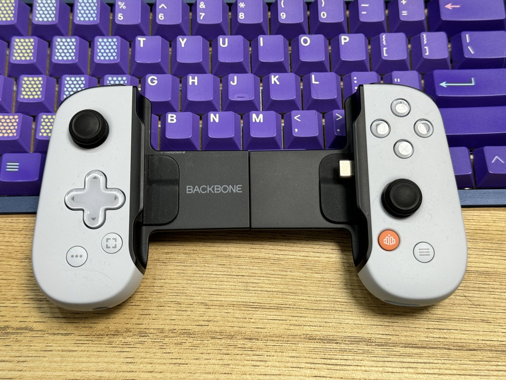

意外としっかりした作りでiPhone 15 Pro Maxとの相性もいいなと思う。PS Remote Playでゲームをやっている。PlayStation 5のスリム版を買ってFF16をやっている。PS5はベストを冠するかといわれるとちょっとやっているゲームが少ない...な...

https://amzn.to/3TQp8f0

### Nintendo Switch(OLED)

PS5はベストには乗らないかなぁと思ってるけどSwitchは断然ベスト。大作ゲームをやるというよりかはインディ−ズゲームを淡々とやってるんだけど、このサイズ感と手軽さがインディーゲームとマッチしすぎてすごいよい。

このサイズ感がかなり気に入っているのでSteamDeckもほしいなぁと思うけどめちゃ重いのでもう少し様子見

### CyberPunk 2077

今年やったゲームはあんまり数多くはないんだけど、2.0としてローンチされたCP2077はかなり面白い。DLCに突入しようと起動したら普通に6時間ぐらいナイトシティをドライブしながらサブクエストをやり尽くしていた...。とある場所でもしゃべったけど、Starfieldにめちゃくちゃ期待を寄せてしまっていてその反動でCP2077を256倍楽しめたような感覚もある。

DLCも引き続きやっていく。

### 山崎貴の世界

僕をミリオタやSFの世界に誘った映像作家の展示会

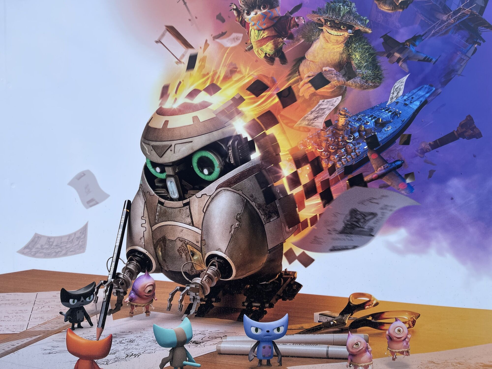

10月の末日に急遽長野県松本市に松本市美術館へ行って来た。電車だと往復で6時間だけど車だと5時間ぐらい。滞在3時間ぐらいだったかな。

プロフィールでは語られることがあまりないけど、「リターナー」という映画を映画館で見て「ウワー」となったのをとても覚えている。SF、タイムトラベル、ミリタリー。今の自分を形作っている要素しかない。

いわゆる過去の作品に関連する小道具や設定資料集などの展示なのだけども「ジュブナイル」に登場した「テトラ」を見て内心きゃーきゃーいいながら写真に撮ったりした。「リターナー」の宇宙船の模型なんかも見られてうれしかったな...。現代だとDVDを買うしかないのがかなりむずがゆいところ。

図録も買ってたまに家で見返している現地にいけてよかったなと思う。

### YAMAHA TRB1005J

10年使った（といっても後半5年はほとんど弾いてなかったけど）IbanezのSR305からお引っ越しする目的で買った。廣井きくりさんのベース（の5弦版）だから買ったということはない。好きですけど。

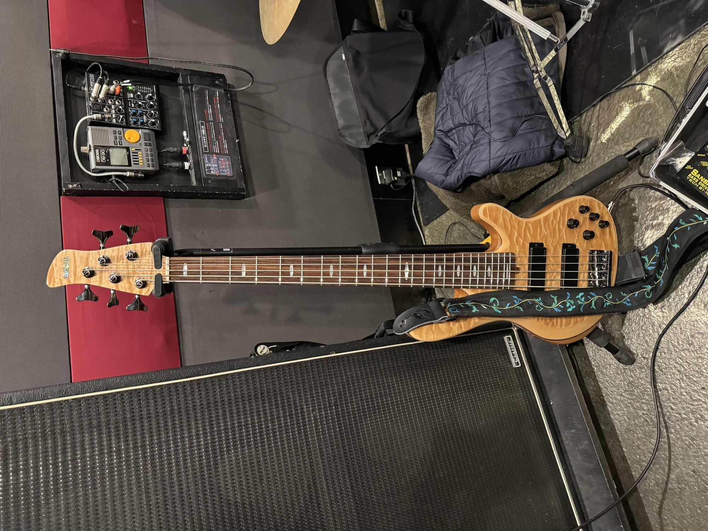

音はIbanezの方がまだ好きかも...。と自宅で練習して思っていたけど、先日スタジオでアンプから音出したら中音域のハリと抜けが気持ちよくて、オッとなった。

併せてAmpegのSGT-DIを買ったのだけどもこれもまだこなれてない感じなので自宅でもう少しいじいじしてみたいところ。SR305とSANSAMPのDI（初代）がまるっと余っているがどうしようかな。思い入れがあるし、リセールバリュー的には二束三文にしかならないのでしばらく自宅で保管かな。

2024年にライブをやる予定があるのでがんばります。
### LOWTEC INDUSTRY MAGPUL SGA870 CO2 Mk13 MEDIUM

CO2ボンベで動作するエアガン。ハイエンドなパーツが組まれているのでとりあえずこれがあれば万能に戦える。あとは体を鍛えるのみ

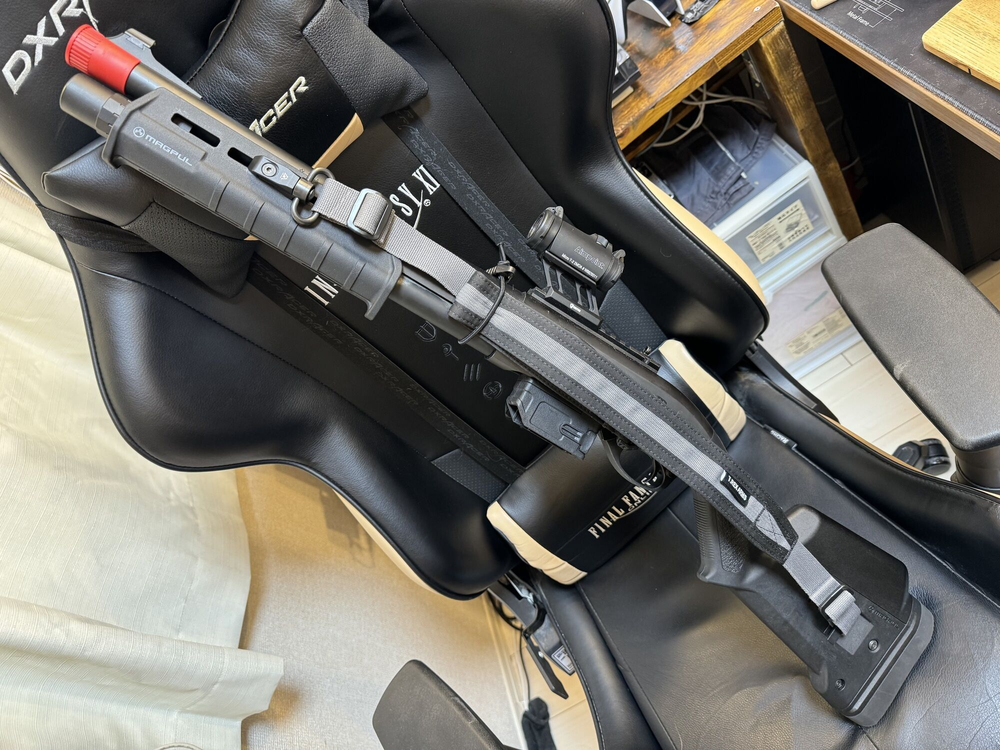

いわゆる外部ソースを利用しているエアガンで近年外部ソースが使えるフィールドも増えてきてるので買ってみた。値段はそこそこするけどそこそこするけど性能自体は東京マルイのM870をベースにしているので命中精度はそこそこあるかなと思っていたけど、M870自体が固定ホップでギュンと弾道が昇っていてしまう。これは宮川ゴムさんが専用のホップパッキンを開発するらしいので期待

BB弾を発射するソースがフロンからCO2になっただけなので実射性能自体は東京マルイに依存するし、パーツもやすい。という目論見がある。トレーニングウェポン（トレポン）だと30万円以上するのでそんなエアガンを持ち歩きたくはない、というのもあるけど、まぁ10万円ぐらいなら、素体になるエアガンを4万円ぐらいで買ってあれこれいじると7～8万円ぐらいになるし、工賃を考えてもコンプリートエアガンとしては普通？ぐらいな値段だと思う。

https://lowtec-industry.shop-pro.jp/?pid=170719864

来年はしばらくこれでサバゲーに行く予定
### まとめ

今年読んだ技術書籍とか良かった小説やDTMのプラグインとかのベストも選ぼうと思ったけど、なんか今年は半ばぐらいから結構しんどい境遇にあって、何かを学ぶというよりかは消費する方面の楽しみを見いだすようになったなと思う。特に今年は同人誌を買う機会が多くてC103でもどうしても手に入れたかった同人誌のお使いを依頼するほどだったなぁ（手に入らないものもあったが...）

Twitterも使い方としては、同人作家さんやイラストレーターさんを以前みたいにリスト管理するんじゃなくてフォローしていいねしまくることでタイムラインを浄化するようにしているのもあって同人誌方面へのアンテナが高まったような感じ。

漫画も引き続きたくさん読んでいるんだけど、昔ほど冒険することがなく、多くの人に読まれていてドラマ化やアニメ化などされた・決まった作品ばかりだったなぁ。やっぱ、自分から漫画を探しにいくという機会は激減したな...。

今年はキーボードは買ってないなぁと思った。一応12月29日にjigsawくんからai03さんのOrbitを譲り受けたのだけども、まだパーツが届いていないので組み立ててないのであった。24年はOrbitで仕事をしていきます。

