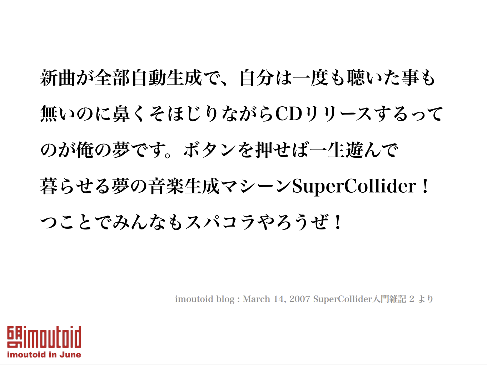
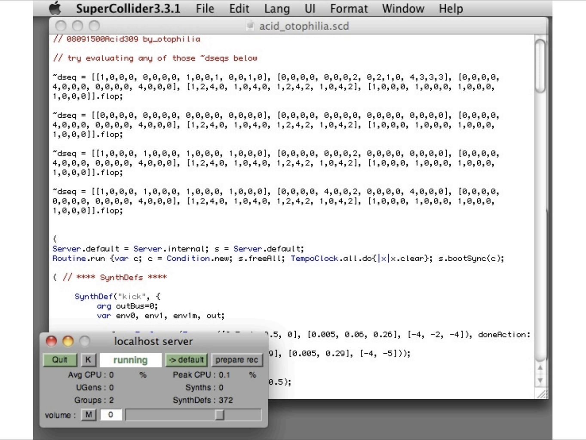

「自分はRubyKaigiで登壇することはあるのだろうか？」というのを思いつつ最後のオーガナイザー業をやったのが2019の話で、翌年に第一子が誕生してしばらくRubyKaigiに参加するどころではなくなった。コロナ禍なのもあって外に出るのが中々難しい時期では（RubyKaigiもtakeoutとして開催されてたね）あったし、同じ年に親になった友達たちとは爆発炎上プロジェクトにOJTで参加しているプログラマさながら右も左もわからないまま過ごすという過酷な日常という変な仲間意識を得たりしていた、ような気がするが、すでに何年も前の話......。

元々音楽が好きでお金にならない趣味のひとつとして音楽をつくることをしていた。ずーっとAbleton LiveというDAWを使ってDJ用のremix曲をつくったり、見よう見まねでトラックをつくったりしていた。ふとしたきっかけでKO-133を購入してハードウェアで音楽をつくるのが楽しいということに気がついた。サンプラーはいいっすよ。KO-133は5万円で買えるいい楽器です。

それがきっかけで機材沼というほどではないが、前のめりに機材を買っていくとノブやスイッチの意味を知っていないと思うように音が出せないことに気がつきました。録音の仕方、小節の増やし方、波形の合成の種類などなど。
そういう基礎的なところを勉強しようと思ってはじめたのが groovebox-ruby というソフトウェアです。2024年の9月ぐらいにコードを書き始めて、まずはRubyでサイン波を鳴らすというところからスタートしました。11月ぐらいには今の実装に近いシンセサイザーになってきて、プロポーザルを書き始めたような気がします。プロポーザルについては SmartBankさんとIVRyの合同開催した「余白」から読み取ってください。

[embed:https://smartbank.connpass.com/event/347455/]

発表の資料はSpeakerDeckにアップロードしてあります。デモが多いので資料だけみてもちょっとわかりにくいところがあると思います。RubyKaigiのYouTubeチャンネルにアーカイブがアップロードされると思うのでそっちをみるとわかりやすいと思います。

資料は以下です。少しおまけのページが増えています。

## 発表後にもらったフィードバック

__Q: GCが走ると音が止まらない？__

A: 止まることもある。

細かくオブジェクトやメモリの使用量を観察していたわけではないけど、波形を生成するときのバッファの書き込みが追いつかなくて音がブツブツなることはありました。
メトリクスを観察してみるというのはやってみようと思います。

__Q: YJITを有効にしてみた？__

A: してない！！！！！！！！！

これは完全に盲点でした。一度シンセサイザーを起動すると似たような波形の生成を続けるのでYJITの恩恵を受けるかもしれません。ここもYJITを有効にしてメトリクスを観察してみたいと思います。

__Q: ADSRの減衰の仕方は変えられる？__

A: 変えられます。

デモのタイミングでは減衰の様子が分かりやすいように、等価直線的に減衰させてましたが、指数関数的な減衰もできます。

## 付録的なお話

自分の楽器のノブやボタンの意味を知るためにコードを書き始めたんだけど、プリセットのキックの音を再現するためにあれこれパラメーターをいじったり波形を重ねられるようになってきて思った事がある。

「これ、SuperColliderじゃね？」

SuperColliderというのは、簡単に言うと、曲や動画をつくれるプログラミング言語のこと。

[embed:https://supercollider.github.io/]

このプログラミング言語を使った有名なアーティストに「imoutoid」という人物がいまして、imoutoidさんの曲は「ADEPRESSIVE CANNOT GOTO THECEREMONY」が有名だろうか。

[embed:http://maltinerecords.cs8.biz/14.html]

imoutoidさんがつくる楽曲の中にはSuperColliderを使ってつくられたものもあり、中々興味深い曲もある。当時(2011年)の自分はプログラミングは少しわかる、音楽のことは吹奏楽部をやっていたぐらいの経験しかなくB♭管楽器（TubaとEuph.）の楽譜と少しの音楽知識しかなくて「プログラミングで音を鳴らす？」という感じだった。

僕がはじめて参加したDJイベントである「6月のimoutoid」はそのimoutoid氏を偲ぶイベントでそこでtofubeatsさんがプレイしたセットが今でも忘れられない。

[embed:https://www.youtube.com/watch?v=wSJssxEsgEQ]

[embed:https://www.youtube.com/watch?v=IAo5gHcasQo]

同じイベントで赤松武子さんとtomad社長のトークがあって、そこではimoutoidさんのSuperColliderの作品を紹介するなかでimoutoidさんのブログの記事を紹介していた

当時の資料でこのように引用されてた。（左下のロゴが格好いいね）

この資料、もうどこにもないっぽいのだが、ちゃんと保全したいな...。

ちなみに、本家の記事はここ

[embed:http://blog.livedoor.jp/imoutoid/archives/51402149.html]

2007年の記事で2025年に読むと、suno.aiの登場があったり、Ableton Liveは簡単なシーケンスであれば自動で生成してくれたりするし、18年で世の中はグッと進化しているなと思った。

tofubeatsさんが2024年にリリースしたI CAN FEEL ITはSyntheizer VというAI歌声合成ソフトを利用してつくられていてそれが商業で発売されてるのがこのブログ記事を思い出す上で想起されてちょっとエモかった

[embed:https://www.youtube.com/watch?v=k5g3pE9sKyo]

SuperColliderは僕は触った事はないんだけど、仕組みとしてはサーバーとクライアントがいてサーバーは音を再生する機能を持っていて、クライアント側でコードでシーケンスを定義したり、波形を生成してサーバー側に送りつけると音がなるらしくて、今回つくったgroovebox-rubyと少し構成が似ているなぁと思った。ただ、構成が似ているだけで設計思想は全然違うと思う。

付録とうたうことで好き勝手に音楽の思い出を書く事ができたので満足。僕の中での発見は、プログラミングで音を鳴らすというのは18年ぐらい前から地続きだったことだな。Happy Hacking!
