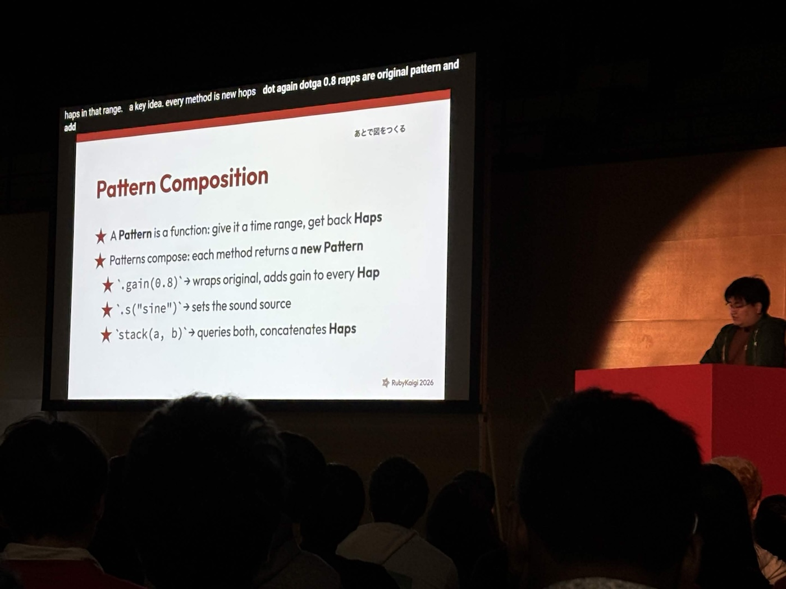
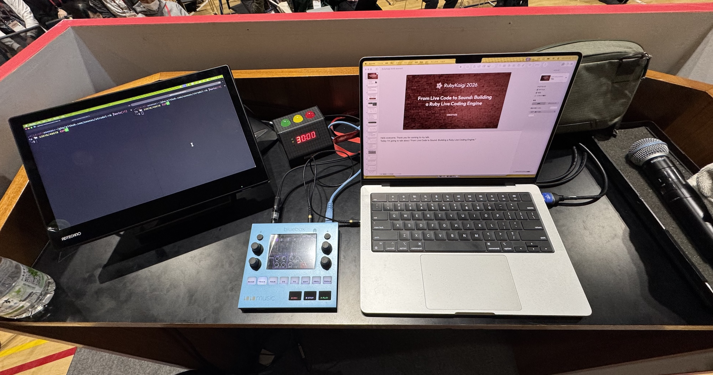
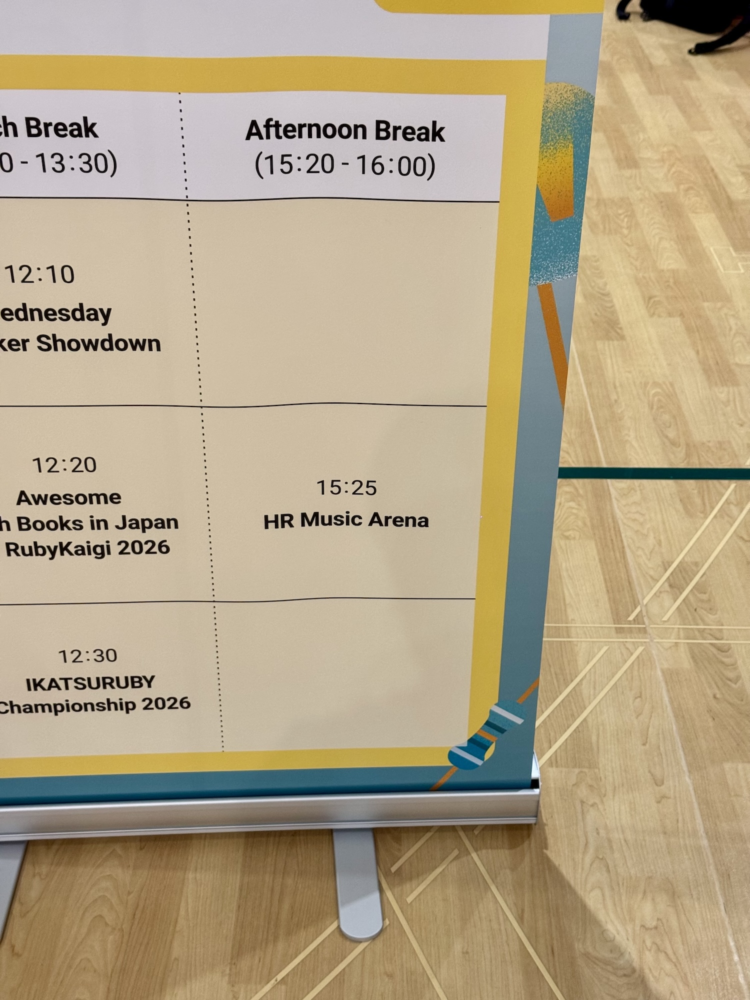
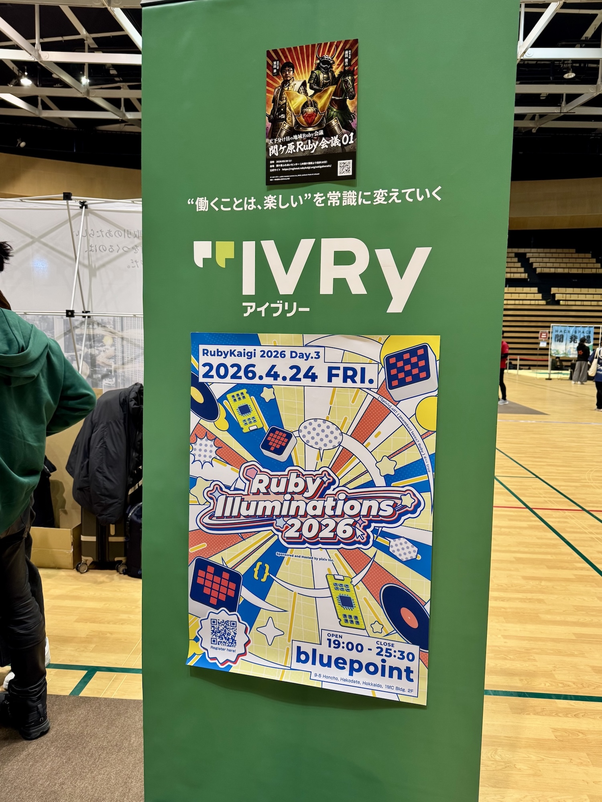
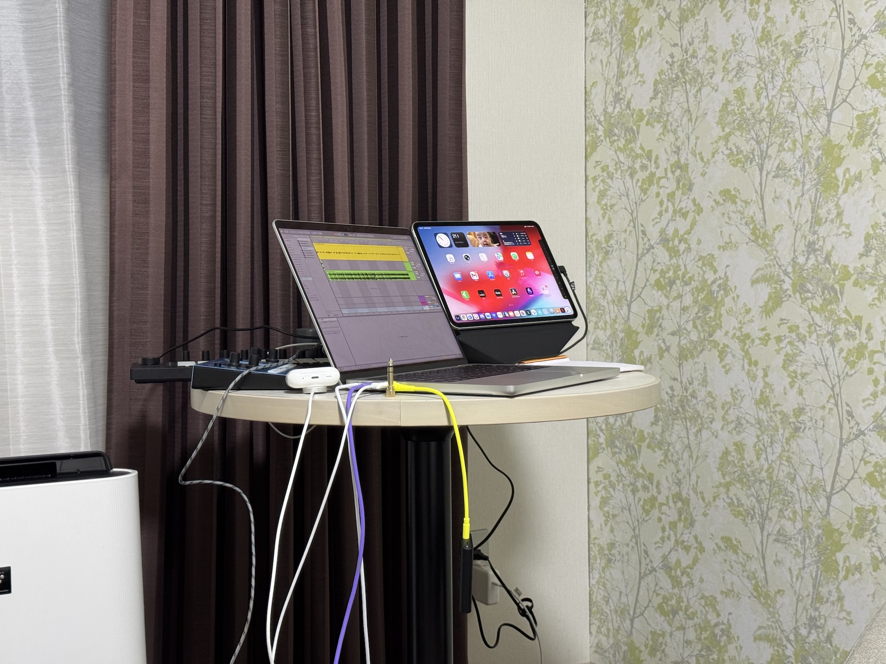

2025年に引き続き2026年でも登壇してきた。Rubyで音を鳴らすのは根源的に面白いというのをテーマにせっせとやっている。

RubyにはRailsを動かすこと以外にも使えるということを活用事例と合わせて発表してるような感じです。

[embed:https://rubykaigi.org/2026/presentations/asonas.html]
資料はここ https://speakerdeck.com/asonas/from-live-code-to-sound-building-a-ruby-live-coding-engine


喋っている様子 via [@osyoyu](https://twitter.com/osyoyu)


今年の登壇台の様子。MacBook Proと[1010MusicのBluebox](https://1010music.com/product/bluebox)のみ。シンプルだね。Blueboxを持ち込んだのは途中で音を鳴らしながら話す必要があったのでミキサーからノブを回してリニアに音量を下げたかったから。

今年の活用事例としては、函館駅や五稜郭本町の交差点などで流れていたRubyKaigiのオーディオコマーシャルのBGMを作成しました。BGMをつくるにあたって、なるべくサンプル音源を使わず、Rubyで書いたオシレーターとピッチベンドを使って曲をつくりました。RubyKaigiのトークでデモをしているので動画公開されたらご覧ください。

<blockquote class="twitter-tweet"><p lang="en" dir="ltr">We actually had Matz record a special RubyKaigi message that’s now being broadcast on the street speakers around Hakodate! The background music was composed by <a href="https://twitter.com/asonas?ref_src=twsrc%5Etfw">@asonas</a> . Keep your ears open near Goryokaku-Honcho and Hakodate Station — you might just catch it! <a href="https://twitter.com/hashtag/rubykaigi?src=hash&amp;ref_src=twsrc%5Etfw">#rubykaigi</a></p>&mdash; Ɩ ıかʓが (@UVB_76) <a href="https://twitter.com/UVB_76/status/2047112877702885545?ref_src=twsrc%5Etfw">April 23, 2026</a></blockquote> <script async src="https://platform.twitter.com/widgets.js" charset="utf-8"></script>

strudel-rbについても触れておくと、元は[Strudel](https://strudel.cc)というブラウザで動くライブコーディングのツールのRuby移植です。Strudelはブラウザベースなのでブラウザの機能が比較的簡単に利用できるのですが、Rubyというかターミナルで動かすには色々自作する必要がありました。

VCAやオシレーターについては昨年つくったgroovebox-rubyを流用したけど、例えばMIDI機器を接続したり、strudelでいうところのorbit(簡単にいうとミキサー的な機能)の制御を自前で実装し直したりしました。

ターミナル、というかUNIXの環境で動くようにして便利なことのひとつに`say`コマンドを利用できることでした。。これはStrudelにはない構文なので、Strudel互換ではない点に注意が必要です。

```ruby
message = "Hello! I am asonas"
track(:asonas) { say(message) }
```

みたいに書くと裏でsayコマンドを起動してそれをwavで保存して再生してくれる。保存するときには、メソッドにわたるメッセージの内容、voice、速度などをキーにしてファイルに保存します。再生の際は同一キーのファイルが存在するか先に探します。一度別のメッセージを流したあとに元のメッセージを再生する場合は、sayコマンドの実行を待たずに再生できるという細かいテクがあります。

上記のメッセージはサイクルごとにループするので無限に「へろーあいあむあそなす」を連発する。声はKyokoがデフォルトなのでかなり日本人アクセントの英語が飛び出てくるのが面白いと思う。オプションで`say(message, voice: "Samantha")` のようにしてsayコマンドが対応している声質で変更することもできます。

リポジトリはここにあります。
https://github.com/asonas/strudel-rb

去年はかなり飛び道具っぽい発表で「なぜ、Rubyでこんなことを？」という質問が何件かもらったのを覚えている。今年はそういう質問はなかった、かな。突然Rubyでグルーブボックスをつくったよと言われてもよくわからないよね〜という反省はありつつ、今年はコードを書くと音がなる、という表現がわかりやすく人々へ響いたのだと思う。そういう意味では成功と言えそう。音がなるとたのしいよね

登壇は英語だった。最初は日本語でプロポーザルを送っていて、後ほど松田さんから英語でお願いできますか？という打診がきていた。実は去年も英語のトークの打診があったんだけど、初登壇で自分の準備もうまくできなさそうだったので日本語にしてたんだけど、今年は2度目の登壇だし、心の準備もできているだろうと思って英語で話をすることにしました。

英語発表では、話したいことの原稿をつくって、それを元に英語の原稿と資料をつくっていましたが、実際やってみるとほとんど原稿をそのまま読むような感じになっていたので少し反省。もう少し英語に慣れたり、英会話の表現を持ち合わせていこうと思います。

今年は初日のトークだけじゃなくて、2日目にはSmartHRさんから声をかけていただき、Main Arenaでライブコーディングをさせていただきました。僕自身は喋らずにsayコマンドと自分の持っているサンプル音源などを利用して5分ぐらいで曲をつくるみたいなことをやりました。ただ、途中でコードのシンタックスエラーに気が付かずに2分ぐらい消費してしまったので思い通りにならなかったのが悔しい！でも、登壇資料にもある通りシンタックス違反があっても音が止まることはなかったのでえらいね。よくできてる(自画自賛)



3日目にはRubyIlluminations 2026にも参加してきました。2日目のときとは違い20分の枠をもらってそこでライブコーディングをしていました。会場の都合でちょっと高い位置にパソコンをおいてタイピングをし続けていたのもあって指や腕がかなり疲れてしまったんですが、それでも楽しかったですね。

[embed:https://pixiv.doorkeeper.jp/events/195875]

トークの感想をもらうこともありつつ、音楽や音に関連する話題で盛り上がれました。pixivさんのスカラシップで参加されている方々からも声をかけていただいてありがたい限りです。

なんとなく会話の端々からDTMやってそうな雰囲気を感じてる方には使ってるDAWはなんですか？というのを聞いてたんですが、RubyIlluminations 2026では圧倒的にAbleton Liveの人が最多だったのがおもしろかった。

会期を通して休憩時間中にはハックスペースやスポンサーブースで質問や雑談をしていました。質問をたくさんもらえてうれしかったな〜。来年も頑張りたいね。

函館らしい写真があるかなと思いつつiPhoneのPhotosを見返しているけど、発表の準備とか雑談とかで撮れてなかったな。


ずっしーほっきーさん。


チラシなども無秩序に貼れる便利なやつ。おかげさまで登壇できております。


お〜、これが噂の〜。となった。


発表を準備をしているようなLiveを起動しているような

今年で2年連続の発表ができてほっと一息ついている。無事に発表が終わってよかったな〜。

Rubyで音を鳴らすことへの理解が深まりつつあり、自分のできることが増えてきているので来年はハードウェアに挑戦します。

<blockquote class="twitter-tweet"><p lang="ja" dir="ltr">秋月電子さんからパーツ届いたのでRubyKaigi 2027が始まりました。 <a href="https://t.co/rwWoaPaNxU">pic.twitter.com/rwWoaPaNxU</a></p>&mdash; あそなす (@asonas) <a href="https://twitter.com/asonas/status/2051530808431886595?ref_src=twsrc%5Etfw">May 5, 2026</a></blockquote> <script async src="https://platform.twitter.com/widgets.js" charset="utf-8"></script>