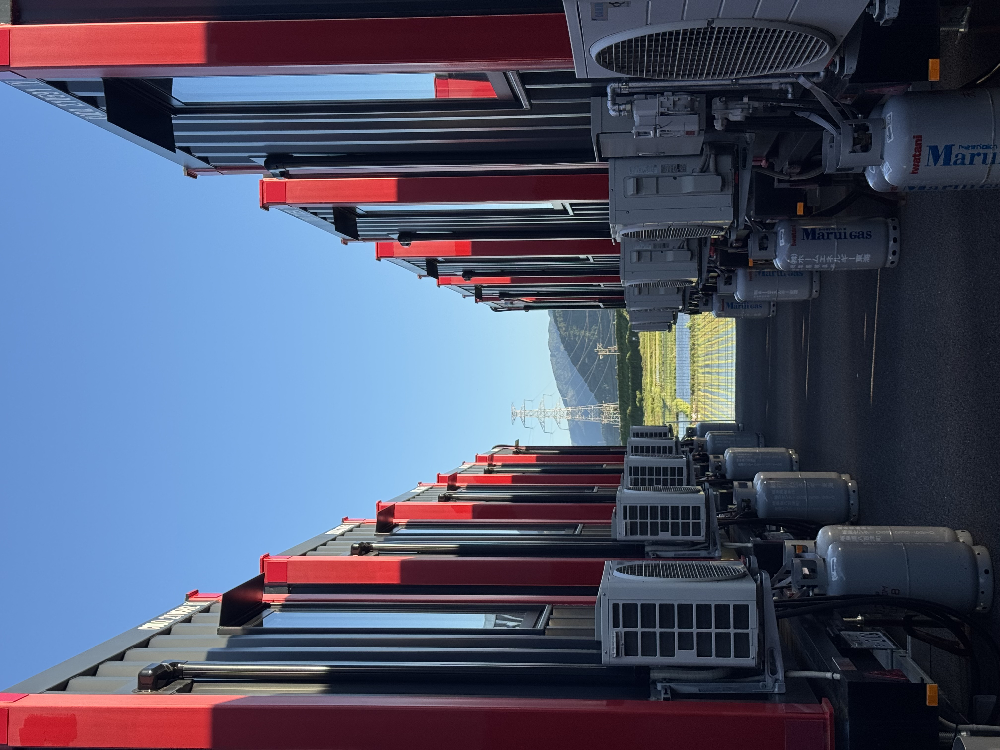
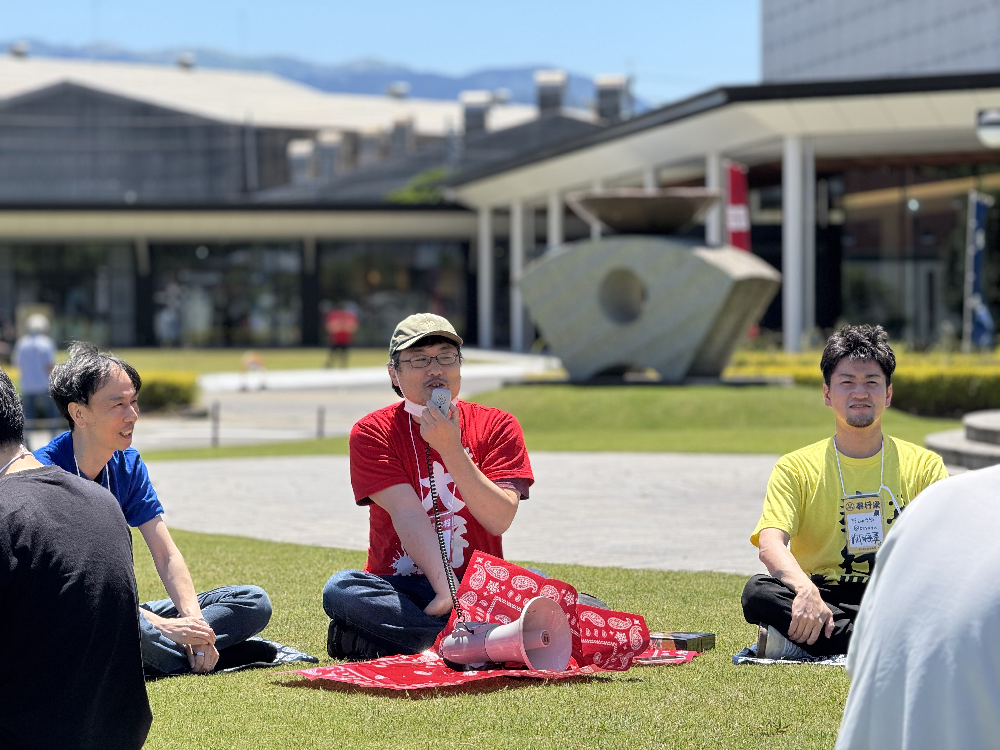

関ヶ原Ruby会議01に参加してきた。岐阜県の関ケ原で開催された地域Ruby会議で、「天下分け目の地域Ruby会議」を謳っている。土地柄もあって、参加者が東軍・西軍に分かれ、戦国武将風の名乗り（武将ネーム）を名乗るという趣向のイベントだった(謎)

僕はそれとなく西側の気持ちがあったので西軍で参加していたのだけども、父親が編纂してる家系図をみると江戸末期ごろまでは遡れていて、池田氏(岡山藩主)に仕えていたらしいので由緒正しくは東軍だったぽい。

今回、自宅から関ヶ原まで、行きも帰りも自分で車を運転して行ってきた。前日に出発して、当日は朝から会議に出て、終わったその日のうちに帰るという日程で、2日で700kmくらい走ったようだ。

宿は垂井にして会場の[関ケ原ふれあいセンター](https://www.town.sekigahara.gifu.jp/2568.htm)まで車で10分ぐらいのところ。R9 The Yardというコンテナを改造したホテルにした。

コンテナがズラッと並んでいて面白い

[embed:https://hotel-r9.jp/brands/theyard/]

ぽこぴーの編集が終わるまで出られないという動画で知ってよさそうだなと思っていたところでもある。

[embed:https://www.youtube.com/watch?v=9PGNgZCbj4E]

宿としては、普通のビジネスホテルという感じ。比較的新しい施設なので外観などはきれいだし、都内とかではできない異質な感じが面白い。アメニティも揃っているし、軽食サービスもあるのでサッと泊まっていくのはいいと思う。動画編集が終わるまで出られないとかだと多分気が狂う。

当日の朝はのんびり出発した。GURUMAN VITALという美味しいパン屋の本店が垂井にあるとのことで向かいたかったが、駐車場の場所がわからないのと慣れない道だったので通り過ぎてしまった。次回行ったときには寄りたい。

[embed:https://guruman.co.jp/]

会場に駐車場があるのかなと思いつつ向かったけどちゃんと駐車場があった。職員用とかじゃないかな？と思って受付に行って聞いてみたら停めて大丈夫ですよとのことだった。

トークはどれもよかったなぁ。それぞれのレーンで型、アート作品、ハードウェア、Rubyの話がそれぞれ聞けて大変満足だった。

hasumikinさんの「PicoRubyに於けるRefinementsの再解釈」の中で、PicoRubyからファイルをcatしてheadするというワンライナーをRefinementsを使うと書けるし動く！というデモをしたんだけど、僕はめっちゃ感嘆したんだけどまわりはシーンと静まり返っていて「あれ！？」ってなった。Refinementsを使ってきれいに物事を解決するというアプローチでめちゃくちゃ感動した。

hasumikinさんの記事や発表資料でも触れられてるんですが、「UNIXという考え方」「なるほどUNIXプロセス」を愛読していると今回のデモ(演武)はシビれるほど格好いいんです。ぜひ読んでください。

[embed:https://hasumikin.com/2026/06/01/sekigahara01.html]

RubyKajaも12年ぶりに再開とのことで、これも大変によかった。コロナ禍でぐっと静まり返ってしまった地域Ruby会議というものがまた再興してきていてそこで活躍している人々にフォーカスを当てる場があるのは大変よかった。

[embed:https://kaja.rubyist.net/2026/kaja/]

古くからいる人も新しい人もノミネートされていて[The Gate](https://rubykaigi.org/2011/en/schedule/details/17M09/)みのある大変心地よい時間だった。kakutaniさんが賞状授与のタイミングで一言コメントを添えながら賞状をわたしていたのもよかった。

今年は地域Ruby会議の参加は予定はないんだけど、久しぶりのソロで遠征したり(妻に感謝!!)、登壇のないRuby会議のも久しぶりでゆったり過ごせたのもよかった。

小話としては、今回やや西寄りの気持ちで参加をしたんですが、自分の先祖を辿っていくと東軍に所以があるらしいので関ヶ原Ruby会議02があれば東軍の気持ちで参加します。

以下はお気に入りの写真 

