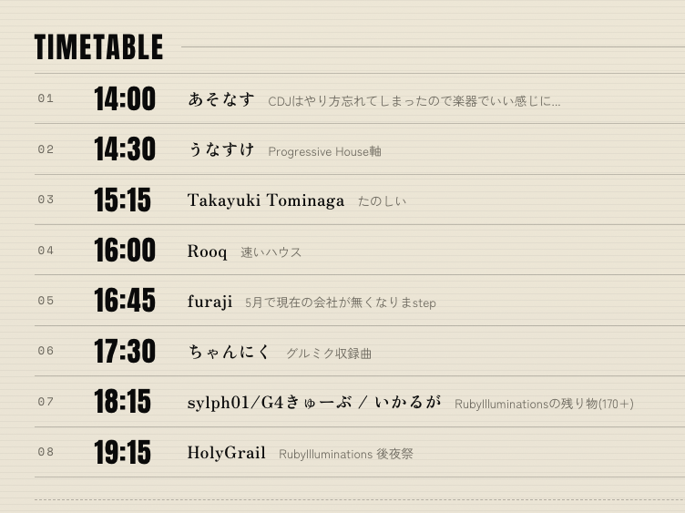
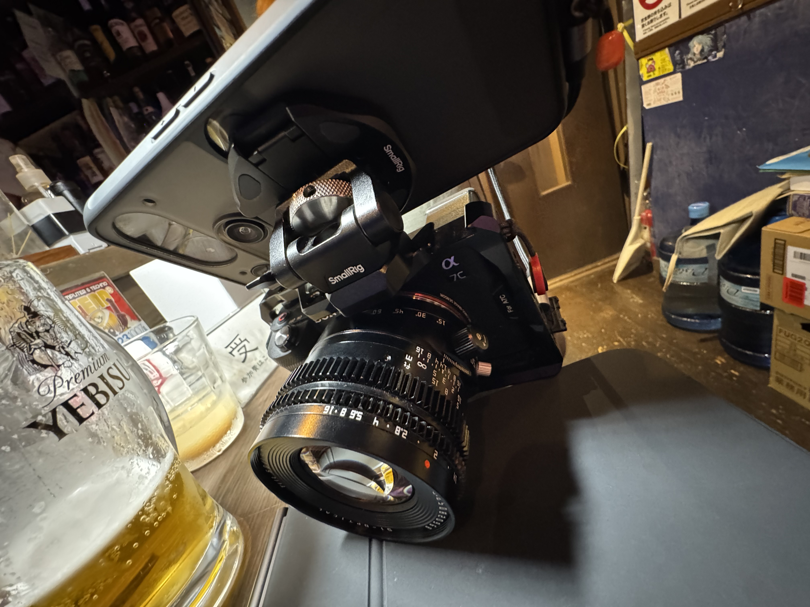

高専DJ部という活動があって、最初は高専カンファレンスの参加者の中で音楽やDJに興味のある人たちが集まる場があって、紆余曲折を経て早稲田にある茶箱さんでDJをやるようになりました。今は高専生じゃない人もDJをしたり参加もしています。高専DJ部というか普通のDJをやる部活動みたいな感じです。「高専」も音としての「こうせん」「こーせん」みたいなアイデンティティがあると思います。

そんな部活動が6月13日に開催されて僕もDJとして久しぶりに参加してきました。近年はRubyで音を出すという活動をしていてもっぱらDAWだのDAWlessでDTMなどをやっていてDJはやっていないので、マシンライブをやることにしました。高専DJ部は自分のDJのジャンルを書く欄があるのだけど、もはやジャンルというか近況とかTwitter的な使い方になっているのが特徴的。

(「楽器でいい感じに...」とは...)

楽器、ひいてはサンプラーやシーケンサーやシンセサイザー、つまりマシンを持ち込んでライブをしてきた。当日の写真は以下のような感じ。(終わったあとに写真撮るため机にビールおいてしまってるが許してくれ...)

機材リストは以下

- OXI One
	- w/ OXI Split
- 1010music Bluebox
- BANANANA EFFECTS Quimera
- Elektron Digitakt II
- Dirtywave M8 Tracker Model:02
- KORG volca drum
- Hologram Microcosm
	- 電源はいれてたけどセットアップが間に合わなくて結局使わなかった

OXI OneからM8とvolca drumとDigitakt IIにMIDIで接続してシーケンス制御をしていた。MIDI ThruでQuimeraでクロックを送りつけていた。

仕込みはほとんどしていなくて、

- volca drumで基本になるシーケンスをあらかじめ打ち込んでおく
- M8でInstを設定しておいてOXI Oneからシーケンスを受け取って鳴らすようにMIDIのマッピングをしておく
- Digitakt IIではプロジェクトをつくっておいてサンプル音源を読ませておく

ぐらいであとはぶっつけでどうにかする、という感じだった。Microcosmでグラニュラーなやつをやりたかったのだけども自宅を出発するのが遅れて開始30分前に到着だったのでとりあえずつないでエイヤで始めた。

基本的にはウワモノのシンセの音はOXI OneのStochastic(確率論的)に設定して音を出していた。音階が出る楽器はあらかじめスケールを揃えておいて破綻しないようにしていた。M8とDigitaktでベースを鳴らすようにしていてM8はQuimeraに接続していたのでDigitakt IIでクラッシュやフィルインをいれたりしつつスイッチをいれてエフェクトをグワグワかけるみたいなことをやっていた。

Blueboxはタッチパネルとノブとボタンで操作をするので自宅で落ち着いた環境でミックスするには問題がないのだけど、忙しく指が動くマシンライブではLaunch Control XLみたいなハードでミキシング行為をするのがいいなとなった。ミュートとかポチっとできるほうがいい...。

あとM8でその場でベースの音を作っていたりもしてたけど、シンセと同じステレオで出力していたけどLとRで分けてLはシンセにしてQuimeraを通す、ベースはそのままBluebox、みたいな構成すればよかったなと思った。

今回のライブに合わせてFURMAN SS-6Bを購入しておいたのはよかった。2x3の6口で幅広なので机の上においても傾くことなく電源を使えていた。自宅だとスペースの関係でAnkerの電源タップを使っているのだが、薄くホワイトノイズが乗るのがすこし困っていたのだけど、SS-6Bだとそんなことはなくてよかった。まぁSS-6Bみたいな高い電源でなくても茶箱さんのようなしっかりした箱ならそうそう困ることはないとは思うが...。自宅の電源事情は追々解決していく。

https://amzn.to/4vSAUFH

当日はカメラで動画を撮っていた。やすい中華のチルトシフトレンズを付けて気合のマニュアルフォーカスとシフト芸をしていた。

マニュアルフォーカスをしているとカメラのディスプレイは小さすぎる問題があるのでNothing Phone3を使って外部ディスプレイとしている。

<blockquote class="twitter-tweet" data-media-max-width="560">
<a href="https://x.com/hashtag/kosendj?src=hash&amp;ref_src=twsrc%5Etfw">#kosendj</a> <a href="https://t.co/B7QZIQm7YH">pic.twitter.com/B7QZIQm7YH</a>
&mdash; あそなす (@asonas) <a href="https://x.com/asonas/status/2065733968847356272?ref_src=twsrc%5Etfw">June 13, 2026</a></blockquote> 

